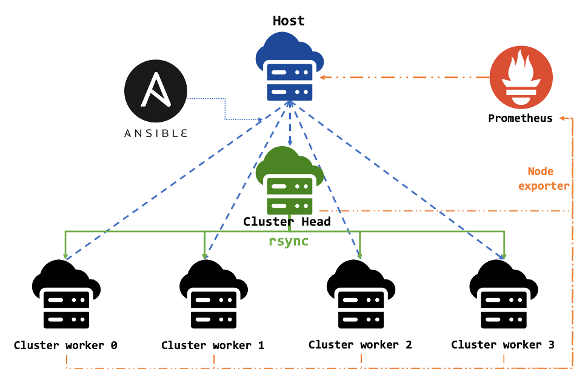

# Distributed Pipeline for Predicting 3D Structures of Proteins
## About
This repository is for using a 6-machine cluster (one host and 5 clients) to make predictions of possible 3D structures of proteins in the Human Genome, which is a huge workload. 
## System Architecture

### Host:
It serves as the control node for managing the cluster. This machine solely provides instructions through the configuration management tool: Ansible to the other nodes in the system while simultaneously monitoring the states of each node.
### Cluster Head:
It serves as the head of the cluster, is primarily responsible for splitting data among each worker and gathering the results from them. It also handles a portion of the tasks. 
### Cluster Workers:
They serve as slaves in the cluster, responsible only for computing the tasks assigned by the Host, receiving input data and datasets, and providing the results.

## Requirements
6 Linux servers
- Host: 
  - 9 GB disk
- Cluster Head:
  - 2 CPU Core and 2 Threads per Core
  - 100 GB disk
- Cluster Worker:
  - 1 CPU Core and 2 Threads per Core
  - 100 GB disk

Tools:
- Python
- pip
  
## Environment Setup
### Ansible
As a manager of the cluster, the Host should have Ansible.
```shell
pip install ansible
# check if ansible is available
ansible --version
```
Add the Cluster nodes' IP addresses to the inventory file so that the Host can control them.
```shell
mkdir ansible && cd ansible
vi inventory.yaml
# see `./ansible/inventory.yaml`
```
Use the command to run all playbooks:
```shell
ansible-playbook --private-key=~/.ssh/{key-name} -i inventory.yaml {playbook-name}.yaml
```
All can clone this repository on Host First.
### Mount Filesystem
Attach a disk with enough capacity to the file system.
- Run `./ansible/mountTheFilesys.yaml`
  - `mountTheFilesys.yaml`: For every cluster nodes, creat a directory that will act as the mount point, formatting the device, and then binding the disk to that mount point.
### Virtual Environment
The ML tools require these Python dependencies
1. biopython
2. torch
3. numpy
4. scipy
- Run `./ansible/configureVenv.yaml`
  - `./ansible/configureVenv.yaml`: Building a virtual environment on all cluster nodes. Installing Biopython, SciPy and Torch.

## Installation
###  Pipeline Code and ML tools
- Run `./ansible/installPackages.yaml`
  - `./ansible/installPackages.yaml`: For every cluster nodes, install required packages, this repository and 2 ML tools: s4pred and hhsuite.
### Dataset for hhsuite
- Run `./ansible/getDataset.yaml` and `./ansible/copyPdb70.yaml`
  - `./ansible/getDataset.yaml`: Get PDB70 database for HHsearch on Cluster Head and unzip it. 
  - `./ansible/copyPdb70.yaml`: Transfer the unzip Pdb70 dataset to Cluster Workers.

## Data Distributing and Prediction Running
### Arrangment the 6000 protein IDs
- Run `./ansible/splitData.yaml`
  - For Cluster Head, filter out 6000 target protein IDs and their corresponding sequences from a file containing information for 41,339 proteins. 
  - Dividing these 6000 tasks into 6 portions, with each batch containing 1000 proteins.
### Input Distributing
- Run `./ansible/copyInput.yaml`
  - `./ansible/copyInput.yaml`: Send each batch from Cluster Head to the respective Cluster Worker.
### Running the Pipeline Script
- Run `./ansible/runScript.yaml`
  - `./ansible/runScript.yaml`: For all cluster nodes, run the shell script `runMultiFile.sh`.
  - `runMultiFile.sh`: Runs the pipeline script with all input files in the input directory in a loop under the virtual environment.
### Output Gathering
- Run `./ansible/copyOutput.yaml`
  - `./ansible/copyOutput.yaml`: Send output from all Cluster Worker back to the Cluster Head.
### Arranging the output
- Run `./ansible/arrangOutput.yaml`
  - Integrate the 6000 output files. Lists all protein IDs with their best-hit IDs and calculates the mean Standard Deviation and mean Geometric Means, 

## Monitoring
### Prometheus
As a manager of the cluster, the Host should have Prometheus.
```shell
mkdir /home/ec2-user/data/prometheus
# download the prometheus with version you want: https://prometheus.io/download/
# unpack it to the directory
tar xvfz prometheus-2.45.1.linux-amd64.tar.gz --directory /home/ec2-user/data/prometheus
cd /home/ec2-user/data/prometheus
# change name
mv prometheus-2.45.1.linux-amd64 prometheus-2.45.1
cd prometheus-2.45.1/
```
Adjust the configuration file (prometheus.yaml) by adding the IP addresses of all 5 cluster nodes to the targets.
```yaml
# prometheus.yaml
- job_name: "prometheus"

    # metrics_path defaults to '/metrics'
    # scheme defaults to 'http'.

    static_configs:
      - targets: ["localhost:9090"]
- job_name: "node"
    static_configs:
      - targets: ['10.0.2.246:9100']
      - targets: ['10.0.5.28:9100']
      - targets: ['10.0.0.170:9100']
      - targets: ['10.0.10.129:9100']
      - targets: ['10.0.6.89:9100']
```
run Prometheus:
```shell
./prometheus --web.enable-admin-api --config.file=prometheus.yml
```
Now you can see the Prometheus UI on the browser: `http://{Host IP public addr:9090}`

### Node exporter
- Run `./ansible/prometheus.yaml`
  - On each Cluster node, download `node_exporter` and ran the exporter in the backgroun so that we can observe the states of each node on Prometheus at any time.

### During node running
- Use Prometheus to monitor the state and CPU load on each node. 
  - The node_exporter provides `node_load`, which represents the load average. Load average is a metric used by Linux to monitor the average number of threads running or waiting at a particular time. 
  - So, in the Prometheus UI, we can use PromQL: `node_load1` / `node_load5` / `node_load15` to observe the load average in 1/5/15 minutes. 


